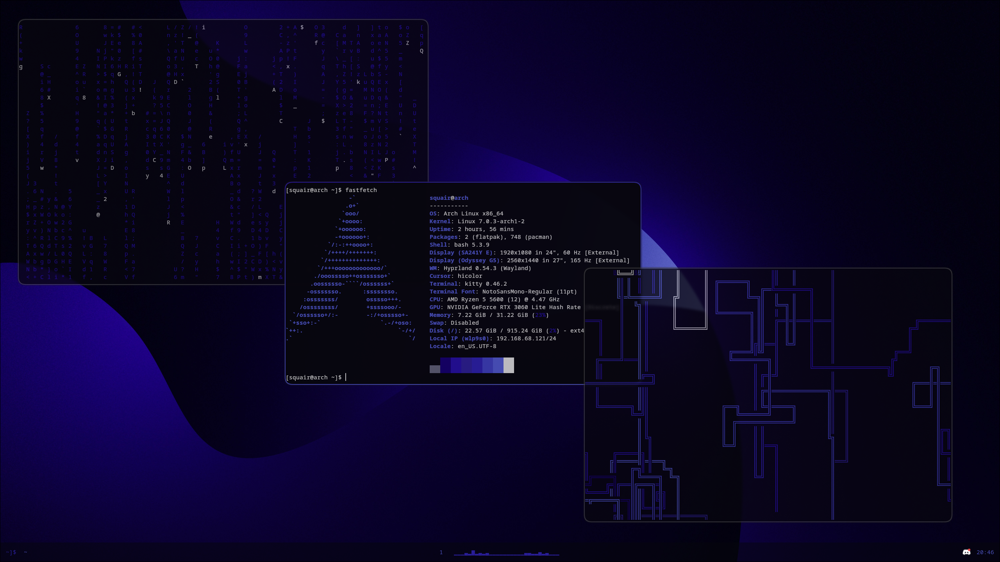
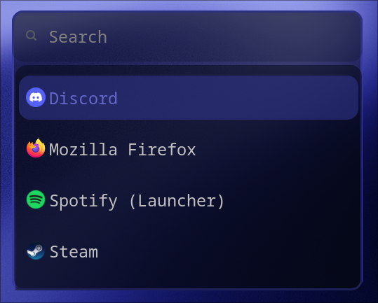
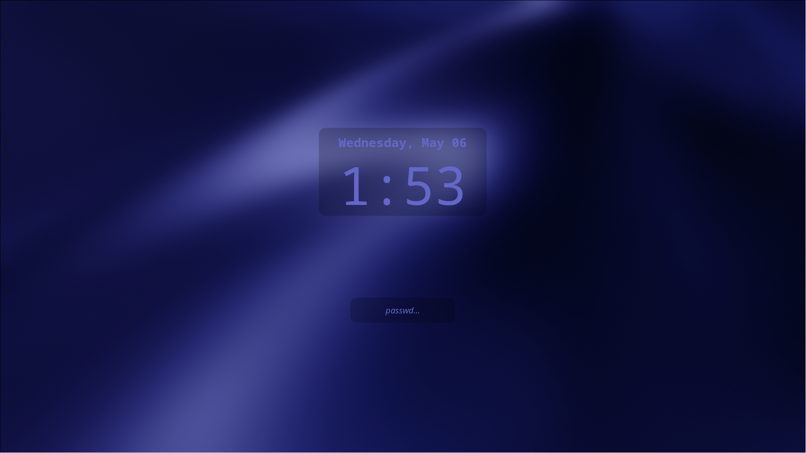
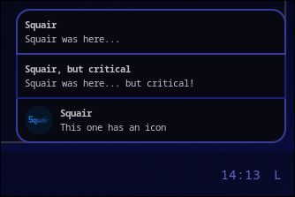

# <h1 align="center" style="font-size:35px">`Squair's dotfiles` </h1>

### <h3 align="center" style="font-size:25px">My custom Dotfiles for Hyprland.</h3>


<p align="center" style="font-size:12px; margin-top:-15px">(note; pictures are captured on a 1440p 27" monitor. Scaling may be different on your end.)</p>

## Installation
You can choose the Nightly release or the GitHub release.<br><br>

<details>

<summary>Full release (github.com)</summary>

<br>You can use the redirect:
```bash
bash <(curl -s https://hypr.squair.xyz)
```

or, directly from the repository:

```bash 
bash <(curl -s https://raw.githubusercontent.com/squairdev/dotfiles/refs/heads/main/install.sh)
```

</details>

<details>

<summary>Nightly release (git.kittycat.boo)</summary>

<br>You can use the redirect:
```bash
bash <(curl -s https://hypr.squair.xyz/nightly)
```

or, directly from the repository:

```bash 
bash <(curl -s https://git.kittycat.boo/Squair/dotfiles/raw/branch/main/install.sh)
```

</details>


## Notes
For the wallpaper script (/bin/swal) to work correctly with Dunst (notification daemon), you must create a symlink.

after applying a wallpaper (so cache gets created), run:

```bash
sudo ln -s ~/.cache/wal/dunstrc ~/.config/dunst/dunstrc
```

If you have any issues, feel free to open an issue or contact me.

## Keybinds
<details><summary>Window Management</summary>

`Mod + [arrow]` - Move to window in [arrow] direction

`Mod + [num]` - Go to [num] workspace

`Mod + Shift + [Num]` - Move window to [num] workspace

`Mod + B` - Close window

`Mod + J` - Switch window tiling direction

`Mod + V` - Switch to floating windows

`Mod + F` - Fullscreen window

`Mod + P` - Pseudo window

`Mod + S` - "Special" workspace

`CTRL+Print` - Screenshot (hyprshot, saves to `~/screenshots`)
</details>

<details><summary>Apps</summary>

`Mod + Space` - Open app

`Mod + Q` - Open terminal (default is kitty, you can change it in `~/.config/hypr/hyprland.conf`)

`Mod + B` - Close window

`Alt + W` - Wallpaper switcher

`Mod + E` - File manager (default is nautilus, you can change it in `~/.config/hypr/hyprland.conf`)
</details>

<details><summary>Session Management</summary>

`Mod + Tab` - wlogout (Lock, Suspend, Restart, Power off)

`Mod + L` - Lock (Hyprlock)


</details>

## Packages (info and manual install)
<details><summary>Wofi (launcher)</summary>


Process launcher.

### Installation

1. Install Wofi
    ```bash
    sudo pacman -S wofi
    ```
2. Copy files

    copy files from `config/.config/wofi` to `~/.config/wofi`

</details>

<details><summary>Hyprlock (lockscreen)</summary>


Lockscreen for Hyprland. Loads on boot. 

### Installation

1. Install Hyprlock
    ```bash
    sudo pacman -S hyprlock
    ```
2. Copy files

    copy files from `config/.config/hypr/hyprlock.conf` to `~/.config/hypr/hyprlock.conf`

</details>

<details><summary>Waybar (taskbar)</summary>


Taskbar. Includes cureent window and workspace, Cava, time and a lock button. 

### Installation

1. Install Waybar & dependencies
    ```bash
    sudo pacman -S waybar pipewire-pulse cava
    ```
2. Copy files

    copy files from `config/.config/waybar` to `~/.config/waybar`

Note: for the audio visualizer in the middle (Cava), make sure the `Recording` output for cava is set to your speakers. You can change it with pavucontrol (`sudo pacman -S pavucontrol`).

</details>

<details><summary>Pywal & AWWW (wallpapers & colors)</summary>


Wallpaper & color daemon.

### Installation

1. Install packages
    ```bash
    sudo pacman -S awww
    yay -S pywal
    ```
2. Copying files

    copy files from `config/.config/wal` to `~/.config/wal`
    <br>copy `config/bin/swal` to `/bin/swal`, or to another path where you can execute `swal` in terminal. 
    <br>You can also place it in another directory, like `/opt/swal`, and then create a symlink from it to `/bin/swal`.

</details>

<details><summary>Dunst (notifications)</summary>


Notification daemon.

### Installation

1. Install Dunst
    ```bash
    sudo pacman -S dunst
    ```
2. Symlinking files

    create a directory at `~/.config/dunst`
    <br>after applying a wallpaper, symlink the file (for colors): `sudo ln -s ~/.cache/wal/dunstrc ~/.config/dunst/dunstrc`
    <br>you only need to do this once. Once the wal cahce is created, every wallpaper applied will update dunst's colors.

</details>


## Tested distros
Only officially tested on Arch and Gentoo (files copied manually, no install script).

I installed Hyprland straight from a fresh install (from tty).