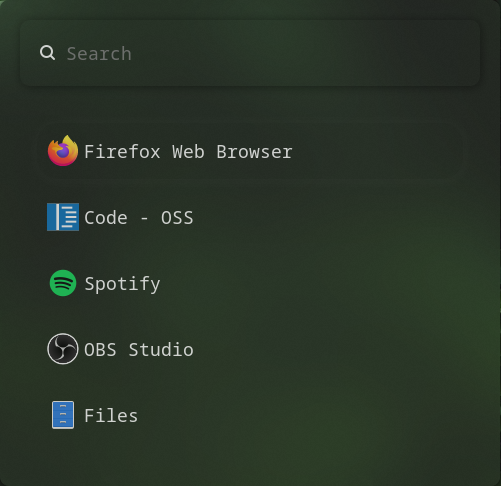

# <h1 align="center" style="font-size:35px">`squairdev/dotfiles` </h1>

### <h3 align="center" style="font-size:25px">My custom Dotfiles for Hyprland.</h3>

<h2 align="center" style="font-size:25px">Installation</h2>
Simply run this command in the linux terminal:

> [!CAUTION]
>
> This script is EXTREMELY experimental and most likely won't work if you don't run it from a fresh install of Arch Linux. You have been warned.

 

`bash <(curl -s https://hypr.squair.xyz)`
<h2 align="center" style="font-size:25px">Packages</h2>

  
Wofi (Launcher)
 
   
  The main app launcher for these dotfiles.
  
## Installation
1. Install Wofi 
`sudo pacman -S wofi`

2. Copying the files 
Once the repository has been cloned/downloaded, copy the files over: 
`dotfiles/.config/wofi/*` to `~/.config/wofi`

 

  
Hyprlock (Lockscreen)
 
   
  Lockscreen for Hyprland. Loads on boot.

## Installation
1. Install Hyprlock 
`sudo pacman -S hyprlock`

2. Copying the files 
Once the repository has been cloned/downloaded, copy the file over: 
`dotfiles/.config/hypr/hyprlock.conf` to `~/.config/hypr/hyprlock.conf`

 

  
Hyprshot (Screenshot)
 
  Screenshot tool for Hyprland.

## Installation
1. Install Hyprshot 
`sudo pacman -S hyprshot grim`

 

  
Ashell (Taskbar)
 
   
  Taskbar for Hyprland. Loads on boot.

## Installation
1. Install Ashell 
`yay -S ashell`

2. Copying the file 
Once the repository has been cloned/downloaded, copy the file over: 
`dotfiles/.config/ashell/config.toml` to `~/.config/ashell/config.toml`

3. Restart Hyprland 
`Mod+M`
 return to hyprland (`hyprland`)

 

  
Pywal/SWWW (Wallpaper managers)
 
   
  Wallpaper managers for Hyprland.

## Installation
1. Install Pywal and SWWW 
`yay -S pywal` 
`sudo pacman -S swww`

2. Copying the files 
Once the repository has been cloned/downloaded, copy the files over: 
`dotfiles/wallpapers/*` to `~/wallpapers/walls` 
`dotfiles/.config/wal/*` to `~/.config/wal` 
`dotfiles/.config/hypr/wallpaper.sh` to `~/.config/hypr/wallpaper.sh`

More documentation coming soon.
<h2 align="center" style="font-size:25px">Keybinds</h2>

  
App related keybinds

- `Mod+Q` Open termainal (kitty)

-  `Mod+R` Open Wofi (App launcher)

-  `Mod+F` Open Files (Nautilus)

-  `Mod+B` Close app

-  `Mod+M` Quit Hyprland

 

  
Window related keybinds

- `Mod+L` Lock screen (hyprlock)

- `CTRL+PRINT` Region Screenshot (Hyprshot)

- `PRINT` Screenshot (Grim)

- `Mod+V` Popout window
  -  `Mod+LeftMouse` Drag window
  -  `Mod+Shift+LeftMouse` Resize window

 

  
Workspace related keybinds

- `Mod+1-9` Switch workspace

- `Mod+Shift+1-9` Move window to workspace

- `Alt+[arrow keys]` Move window

- `Alt+W` Wallpaper switcher

 

  
Miscellaneous app keybinds

  - `ALT+F` Fastfetch

  - `ALT+C` Cmatrix

  - `ALT+B` BTOP++

  - `ALT+V` Cava

  - `ALT+P` Music player (coming soon)

<h2 align="center" style="font-size:25px">Help</h2>

  
Screenshot keybinds not working

If for some reason the keybinds for screenshotting don't work, try reinstalling the packages:

 

`sudo pacman -S hyprshot grim`

 

  
Some features not installed

If you run `hyprland` and ashell (taskbar) is not displaying, re-run the script inside of kitty (terminal):

 

`bash <(curl -s https://hypr.squair.xyz)`

<h2 align="center" style="font-size:25px">Tested distros</h2>
Only officially tested on Arch linux. 
I installed Hyprland straight from a fresh install (only tty, no DM)